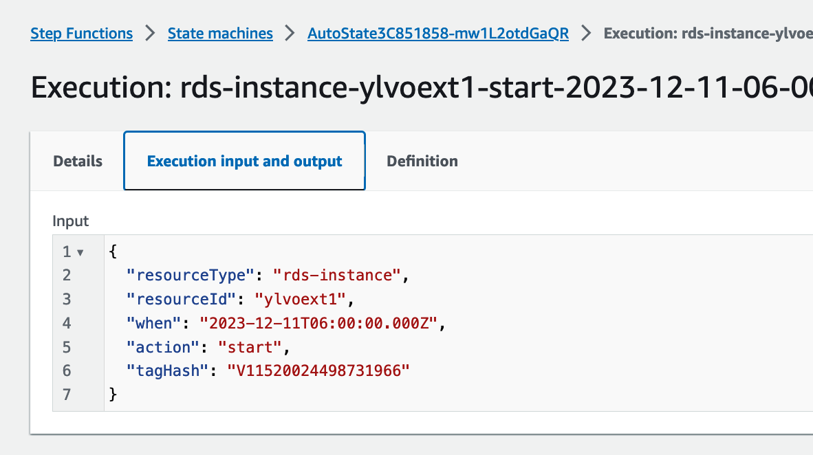

# Auto State

An AWS CDK project that automatically starts, stops, reboots and terminates resources through tags.

## Supported Resource Types
 * EC2 Instances
 * RDS Instances
 * RDS Clusters
 * ECS Services

## Supported Tags

| Tag                                 | Description                                                                                                        |
|-------------------------------------|--------------------------------------------------------------------------------------------------------------------|
| autostate:timezone                  | The timezone to use when interpreting schedules. Defaults to UTC. Example: America/Denver                          |
| autostate:start-schedule            | The schedule as a cron expression to start the resource. Example: 0 8 * * 1-5                                      |
| autostate:stop-schedule             | The schedule as a cron expression to stop the resource. Example: 0 18 * * 1-5                                      |
| autostate:reboot-schedule           | The schedule as a cron expression to reboot the instance. Example: 0 12 * * 1-5                                    |
| autostate:max-runtime               | The number of minutes the resource may run before being stopped.                                                   |
| autostate:max-lifetime              | The number of minutes the resource may exist before being terminated.                                              |
| autostate:skip-final-snapshot       | Applies to RDS. If set to true, the resource will be terminated without taking a final snapshot. Default is false. |
| autostate:final-snapshot-identifier | Applies to RDS. Used if skip-final-snapshot is set to false. Default "autostatefinal"                              |
| autostate:desired-count             | Applies to ECS. The number of tasks to run for the service when starting. Default 1.                               |


### Con Expressions
```
 *    *    *    *    *
 ┬    ┬    ┬    ┬    ┬
 │    │    │    │    |
 │    │    │    │    └ day of week (0 - 7, 1L - 7L) (0 or 7 is Sun)
 │    │    │    └───── month (1 - 12)
 │    │    └────────── day of month (1 - 31, L)
 │    └─────────────── hour (0 - 23)
 └──────────────────── minute (0 - 59)
```

### Cron Examples

* `0 8 * * 1-5` - 8am on weekdays
* `0 18 * * 0,6` - 6pm on weekends
* `0 12 * * *` - 12pm every day

### Tag Examples

Start an instance every 15 minutes and shut it down 5 minutes after.
```json
{
  "autostate:start-schedule": "0,15,30,45 * * * *", 
  "autostate:stop-schedule": "5,20,35,50 * * * *"
}
```

Start an instance every 30 minutes and shut it down 10 minutes after it starts on weekdays.
```json
{
  "autostate:start-schedule": "0,30 * * * 1-5", 
  "autostate:max-runtime": "10"
}
```


## Caveats

 * ECS and RDS don't allow asterisks or commas in tag values so use hyphens and colons instead when defining cron expressions
    Start an RDS cluster every 30 minutes and shut it down 15 minutes after it starts on weekdays.
    ```json
    {
      "autostate:start-schedule": "0:30 - - - 1-5", 
      "autostate:max-runtime": "10"
    }
    ```

 * The terminate-schedule and reboot-schedule tags are ignored for ECS services.

 * RDS doesn't allow termination of RDS clusters when they are stopped

## References

This project is also published as a AWS CDK Construct for use in your own stacks.
See https://github.com/truemark/cdk-autostate

## Troubleshooting

### How can I tell if the task is scheduled?
Within the AWS console, open the State machine named with the prefix AutoState. 


The state machine page will display all executions on the bottom of the screen. 

The executions with non intuitive hex names are scheduler jobs. They execute, schedule actions, and quit. The executions with service name prefixes (ecs-service, rds-instance) are the scheduled state changes. To see the details behind one of the jobs, double click on it. 

Within the next screen, click on Execution input and output. 

We can now view the action, resource, and time scheduled. 


### Changing Tags
When tags are changed, Autostate schedules the actions like nothing is currently scheduled. In other words, any future scheduled actions spinning away in the Autostate state machine are still present. They will need to be killed manually, as they will still manipulate the service in it's scheduled manner, at it's scheduled time. 

For example, ext1 is scheduled to start on the 11th. 



When I change the tags, in this case from 23:00 to 23:01

the new schedule is fired, and the old one is still present. 

In order to ensure service manpulation on the correct schedule, manually stop the old execution.


